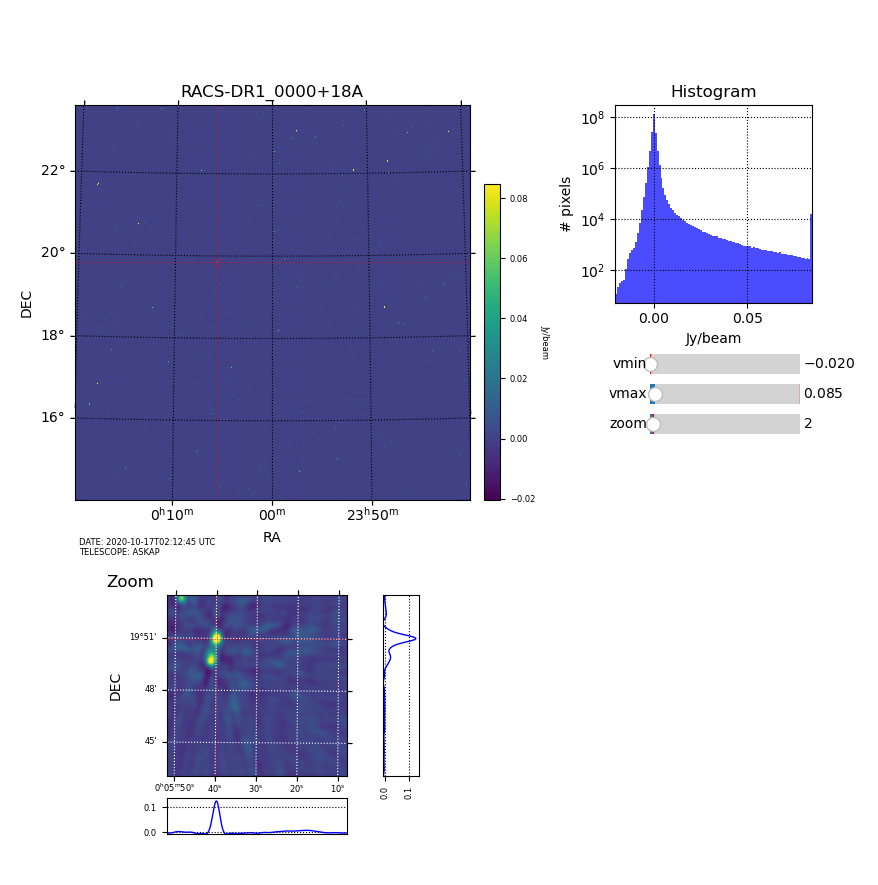

# astrotools

Repository containing a few regularly-used tools. 

Free to use but not guaranteed. 

---
## Install

Fairly easy... 

### Clone the repo

As usual, clone the repo somewhere.
```
git clone https://github.com/GregS1t/astrotools.git
```

### Dependancies

| [numpy](https://numpy.org/) | [scipy](https://www.scipy.org/) | [matplotlib](https://matplotlib.org/) | [pandas](https://pandas.pydata.org/) | [astropy](https://www.astropy.org/) 
| :-----: | :-----: | :----------: | :------: | :--------: |  

### Paths

Don't forget to add `$ASTROCODE` to your `$PATH` so you can use it to call python codes from scripts.

Next, you can add another path to the scripts so you can run them from anywhere. It's up to you.

Example : 

```
# Path to ASTROTOOLS
export ASTROCODE=[PATH/TO]/astrotools/src
export ASTROSCRIPTS=[PATH/TO]/scripts

# Add path to python scripts
export PATH=$PATH:$ASTROSCRIPTS
```

Obviously, you change `[PATH/TO]` to the correct path for you.

---
## pfits GUI

`pfits`  is the simplest GUI for plotting a FITS file with very basic options for zooming anywhere in the main image.

### How to use is

- Play with sliders vmin and vmax to adjust contrast. The contrast is updated on both main and zoomed image

- On the main image
	- Click anywhere to get a zoom in the zoom windows

- On the zoom image
	- Left-click to get the intensity profiles on both axes at the clicked point
	- Right-click to center clicked point in the zoom window 
	- Mouse wheel to zoom in/out. 

That's all there is to it! 

### GUI




